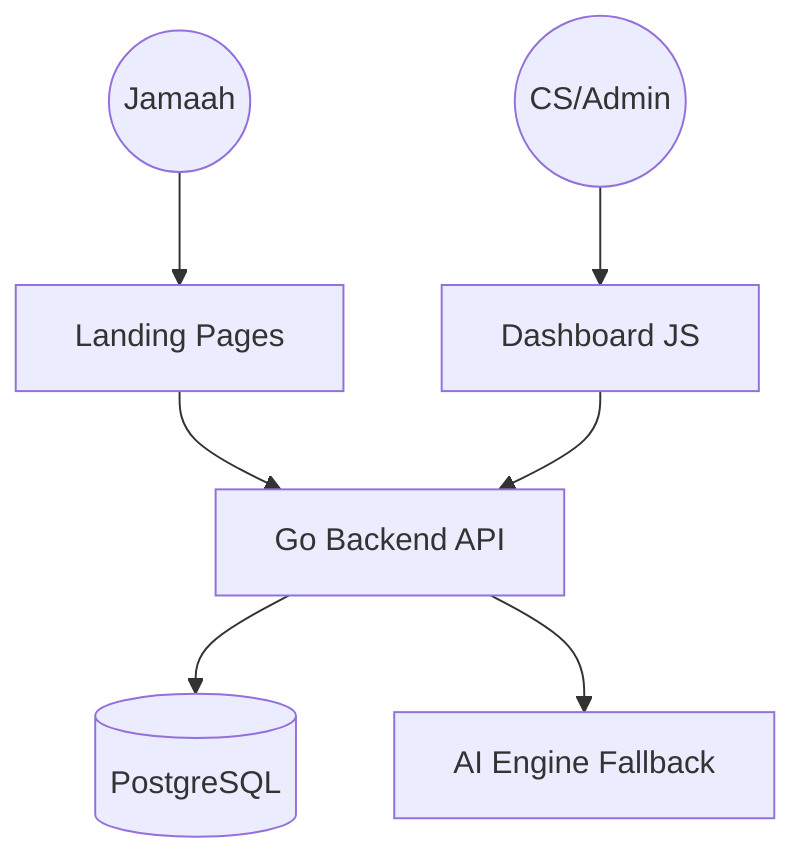

# 🏗️ Arsitektur Teknologi: Munira Workspace CRM

Dokumen ini menjelaskan bagaimana teknologi di balik **Munira Workspace CRM** bekerja, mulai dari infrastruktur hingga kecerdasan buatan (AI) yang digunakan.

---

## 1. Arsitektur Umum (System Overview)
Sistem ini menggunakan arsitektur **Hybrid Monolith-Micro-frontend**. Meskipun semua komponen dikemas dalam satu kontrol akses, sistem ini memisahkan tanggung jawab antara:
- **Backend API**: Mesin pengolah data dan logika bisnis (Go).
- **Admin Dashboard**: Antarmuka manajemen penjualan (Vanilla JS).
- **Landing Pages (LP)**: Halaman penangkap data jamaah (Progressive Web Forms).

---

## 2. Backend Engine (The Core)
Backend dibangun menggunakan bahasa pemrograman **Go (Golang)** dengan pola **Clean Architecture**.

### 🛠️ Teknologi Utama:
- **Language**: Go 1.22+
- **Web Framework**: [Gin Gonic](https://github.com/gin-gonic/gin) (Sangat cepat dan ringan).
- **Database Driver**: [pgx/v5](https://github.com/jackc/pgx) (Driver PostgreSQL berperforma tinggi).
- **Authentication**: JWT (JSON Web Token) dengan skema *Mock/Dummy* untuk fleksibilitas master admin.

### 📂 Struktur Kode (Clean Architecture):
- `internal/domain`: Berisi definisi entitas (Lead, AdminUser) dan interface.
- `internal/delivery/http`: Handler yang menerima request masuk.
- `internal/usecase`: Otak dari aplikasi tempat logika bisnis berada.
- `internal/repository/postgres`: Implementasi akses database.

---

## 3. Frontend & Dashboard (The Interface)
Berbeda dengan web modern yang berat (React/Next.js), Munira menggunakan **High-Performance Vanilla Technology**.

### 🎨 Design System:
- **Vanilla CSS**: Menggunakan variabel CSS modern (`--brand`, `--bg-app`) untuk mendukung Dark Mode, Light Mode, dan Sepia Mode secara instan.
- **Glassmorphism**: Estetika premium dengan efek *blur* di sidebar dan kartu data.

### 🧠 Logic UI:
- **Modular JS**: Logika dipisah dalam file-file spesifik di folder `dashboard/js/` (misalnya: `ai_concierge.js`, `leads_ui.js`).
- **Real-time Simulation**: Dashboard melakukan *polling* ringan untuk memastikan data *Recent Inquiries* selalu segar.
- **Progressive Web App (PWA)**: Mendukung instalasi di perangkat mobile (Android/iOS) menggunakan `sw.js` (Service Worker).

---

## 4. AI Engine: The Brain (Fallback System)
Fitur unggulan **AI Concierge** dirancang agar tidak pernah mati (*High Availability*).

### 🤖 Mekanisme Multi-LLM:
Sistem tidak bergantung pada satu vendor. Jika satu layanan *error*, sistem otomatis berpindah ke cadangan:
1. **Tier 1 (OpenAI)**: Menggunakan model `gpt-4o` (Paling cerdas).
2. **Tier 2 (Bype Plus)**: Menggunakan endpoint Doubao/Ark sebagai cadangan pertama.
3. **Tier 3 (Google Gemini)**: Menggunakan `gemini-2.0-flash` via OpenAI Compatibility sebagai cadangan terakhir.

### 📝 Prompt Engineering:
Sistem mengirimkan profil lengkap jamaah (Usia, Domisili, Harapan Utama, Riwayat Chat) ke AI untuk menghasilkan 3 jenis pesan:
- **Tone Spiritual**: Fokus pada niat dan keberkahan.
- **Tone Solutif**: Fokus pada fasilitas (Bagasi, Hotel, Audio Guide).
- **Tone Urgensi**: Fokus pada sisa kuota.

---

## 5. Database & Sinkronisasi
Menggunakan **PostgreSQL 15** sebagai penyimpanan data relasional.

### 💾 Skema Data Penting:
- **JSONB Column**: Tabel `leads` menggunakan kolom tipe JSONB untuk menyimpan `preferences` dan `status_history`. Ini memungkinkan penyimpanan data dinamis tanpa harus mengubah skema database secara terus-menerus.
- **Soft Deletes**: Data yang dihapus tidak benar-benar hilang dari database, melainkan masuk ke *Recycle Bin* (kolom `is_deleted`).

---

## 6. Infrastruktur & Deployment
Seluruh aplikasi dikemas menggunakan **Docker**, sehingga instalasi di server baru sangat mudah.

### 🐳 Kontainerisasi:
- **Container 1 (Backend)**: Menjalankan API Go dan melayani file statis dashboard.
- **Container 2 (Postgres)**: Menjalankan database dengan volume persisten agar data tidak hilang jika server mati.

### ⚙️ Environment (.env):
Konfigurasi rahasia (API Key, Database URI, Master Credential) disimpan secara terpisah di file `.env` agar keamanan tetap terjaga.

---

> [!NOTE]
> **Munira Workspace** dirancang untuk performa (Lighthouse Score Tinggi) dan kemudahan kustomisasi tanpa harus mengandalkan framework-framework berat.
